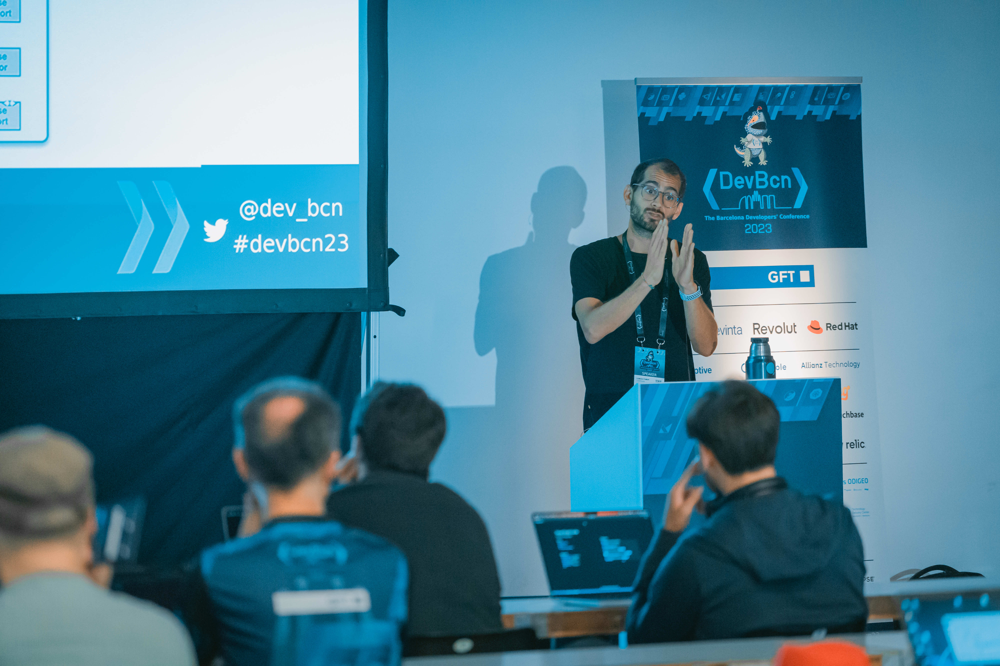

# Curso de Arquitectura hexagonal con Domain-Driven design y TDD

# 🙌 Proposal

- ⏰ 4 days of online course, 4 hours per day (morning or afternoon)
- 👨‍💻 Team
  - 6-10 people
  - Mid/senior
- 💶 Price
  - To define.
  - Discount by Fundae (only Spain) → [https://www.fundae.es/](https://www.fundae.es/)

> 🤞 Requirements
>
> - ⌨️ Development environment working
> - 🏃 Java, C# or Typescript
> - 📜 git

> 🏋🏼 The work modality will be with [https://www.codescouts.academy/blog/mob-programming/](https://www.codescouts.academy/blog/mob-programming/)

> 💡Optional: Each class will be recorded and uploaded to the Codescouts Campus automatically at the end of each session (private workspace for you) So students can review the classes, or see them if they have not been able to attend → [https: //campus.codescouts.academy/] (https://campus.codescouts.academy/)

# 📋 Agenda

## 1️⃣ Day 1 - Domain-Driven Design 🤔

- 🤝 Presentation → ⏲️**15min**
- 🤲 Introduction to the Explanation course of the 4 -day agenda → ⏲️**10min**
- 🤔 What is Domain-Driven Design?→ ⏲️**10min**
- 🧱 Key DDD concepts → ⏲️**40min**
  - 🎙️ Ubiquitous Language
  - 🏞️ Domain, Entities and Value Objects Model
  - ⛽️ Domain services
  - 𝌞 Bounded Context
  - 💾 Domain Model VS Database Model
- 🎾 DDD practice → ⏲️**3hs**
  - From a predefined problem we will make**2 groups of 4 people maximum**where they must develop the domain model, understand and detect what the entity model is, detect the value objects and assume the responsibility of both of each of each one of eachthey.
  - They must correctly model the domain model based on an interaction diagram that explains in detail what the flow of a user in a certain context.

## 2️⃣ Day 2 -Hexagonal Architecture 👀

- ⬡ Hexagonal architecture → ⏲️**40min**
  - 🧩 What are your components?
  - 🤝 How do we relate DDD with hexagonal architecture?
  - 🤔 What advantages and disadvantages do you have?
  - 🛳️ Why so many ports?
- ⚽️ Practice → ⏲️**3hs**
  - ⏳ Change implementations in execution time
  - 🧪 We test our domain
  - 🧪 Easy to do integration tests
  - 🖲️ Implementation in Backend
- 🎯 Review of an example code that I will leave to analyze and finish →**⏲️20min**

## 3️⃣ Day 3 - Hexagonal Architecture & DDD 👀

- 👀 Review and correction of the exercise to be finished ⏲️**1h**
- We continue with hexagonal architecture
- ⚽️ Practice → ⏲️**3hs**
  - 🎯 Good practices when making tests to integrate our adapters
  - 🚨 Domain events
  - 🖲️ Implementation in Backend
  - 🧑‍💻 Implementation in Frond
  - 🏟️ Use cases and when hexagonal architecture is not recommended

## 4️⃣ Day 4 - TDD 🏃

- 🔴🟢🔵 Test-Driven Design → ⏲️**1hs**
  - What is TDD?
  - Repeat after me, TDD is not a testing technique...
  - Baby Steps
  - TDD laws
  - Red, Green, What?
  - outside-in / London School
  - Inside-Out / Chicago School
  - Mockist
  - AAA / Given, When, Then
- 🏈 Kata Roman Numbers → ⏲️**3hs**
- 😢 In this course **No** You can explain the outside-in technique, since it is a slightly more complex technique and time will not reach.
- 🦉 Feedback → ⏲️**10min**

## 💪 Consulting Day (8 hours of work together)

This day is to work hand in hand with the team, the main objective is to land the concepts and practices learned in the course in the current project, also review the following points next to the team.

- 🤔 Current Architecture Consulting
- 😭 Pain Points review
- 🤜 Recommendations
- 🕸️ Refactorization
- 🦾 Improvement margin
- 🧩 Review of potential modules a prioritize the test
- 🕵️ Code base and improvement suggestions
- 💣 Rigid design, separation of clear responsibilities?

# 🥋 Coach

Damián Pumar

Technical coach / Software craftsman / Speaker

🌐 [https://damianpumar.com/](https://damianpumar.com/)

🐦 [https://twitter.com/damianpumar](https://twitter.com/damianpumar)

> 🎤Latest speaker conference 👉
> [https://www.damianpumar.com/events/](https://www.damianpumar.com/events/)
